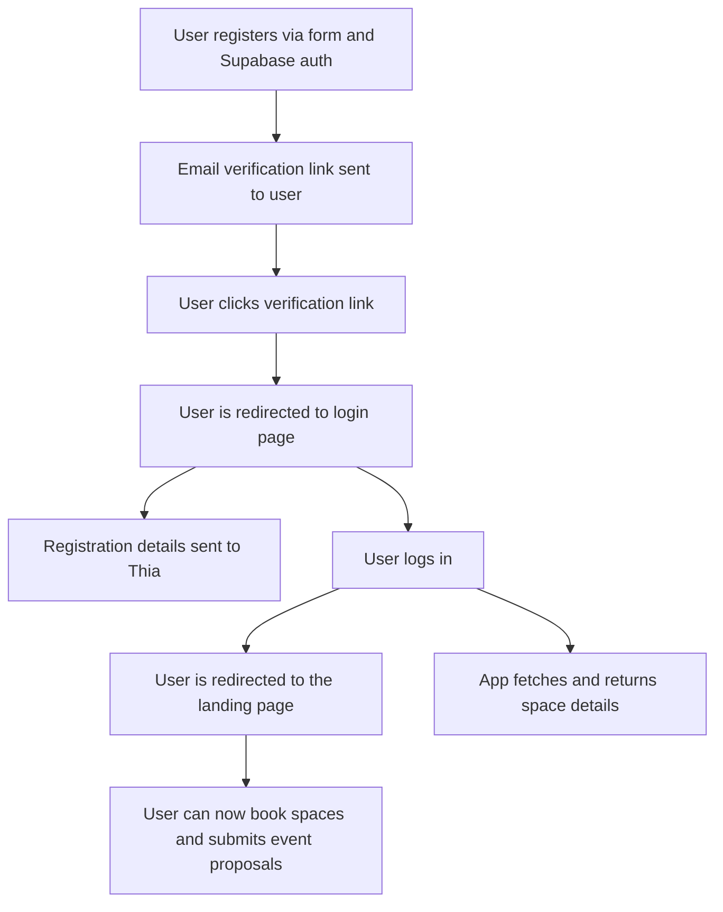
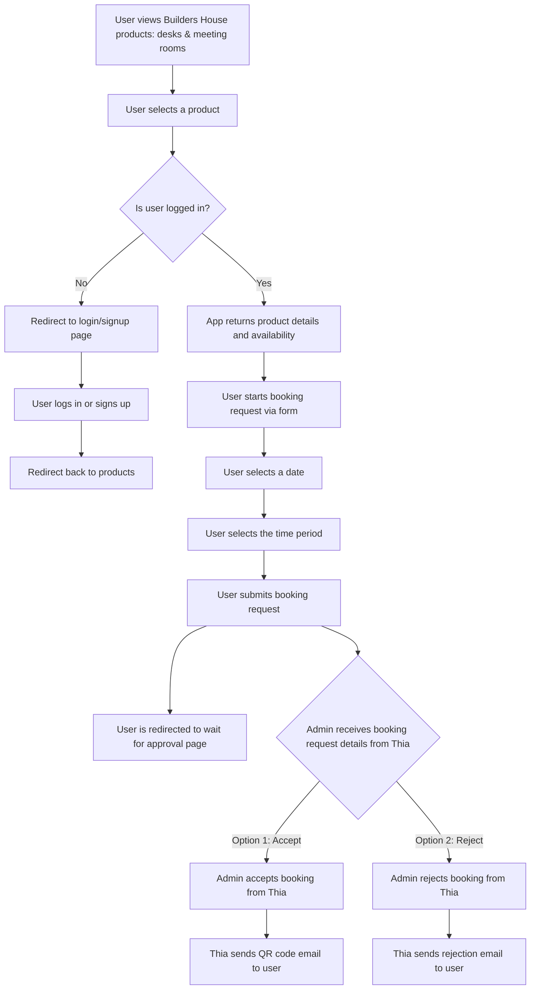
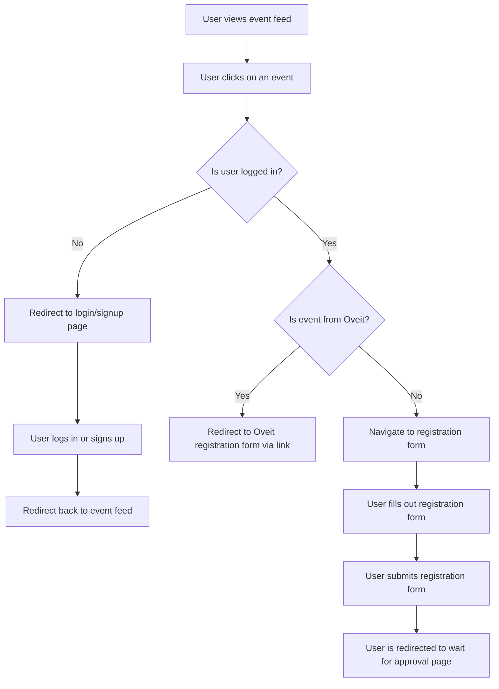
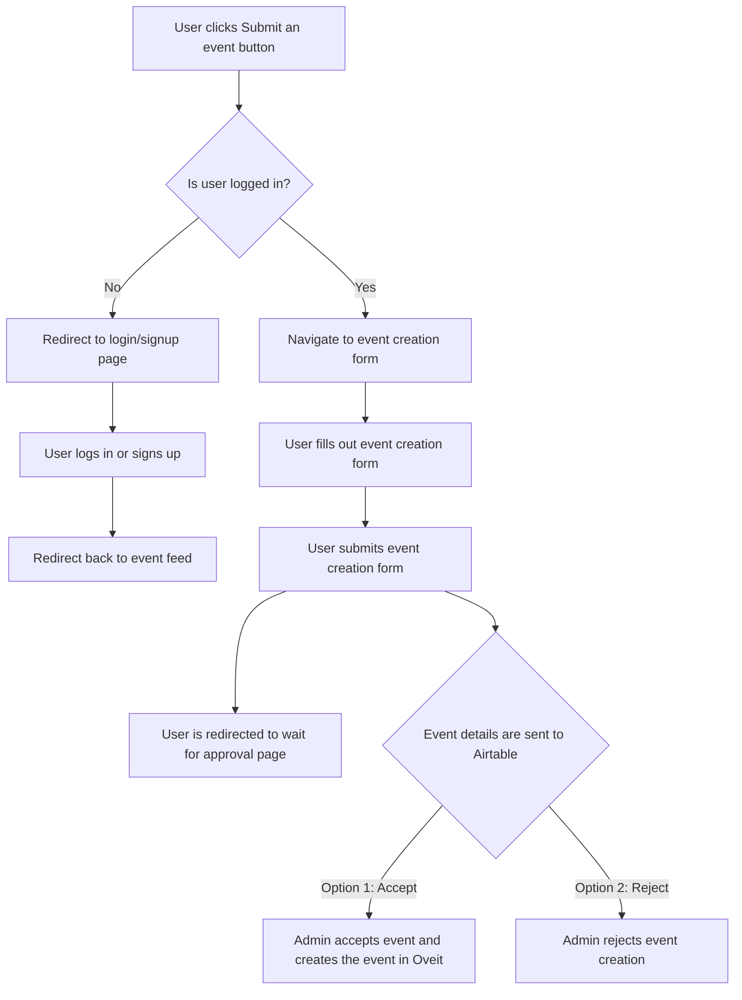

# Builders House Hackathon

## Goal

Create the digital identity for **Builders House** by *[How to Web](https://howtoweb.co/)* to showcase its story, enable event discovery, and streamline bookings, fostering a vibrant community of builders and startups.

## Tech Stack Limits

### Frontend
- [Next.js](https://nextjs.org/docs) for landing page. You can use any of the following [templates](https://vercel.com/templates?database=supabase&auth=supabase-auth&framework=next.js) to start the project

- UI has to be [shadcn/ui](https://ui.shadcn.com) and [Tailwind CSS](https://tailwindcss.com/) compatible.

- You can use any of the following UI kits for your project:
  - [21.dev](https://21st.dev) - A collection of community-driven UI components, where you can get inspired, and also share your creations.
  - [Origin UI](https://originui.com) - A collection of components, layouts and easing classes
  - [Aceternity UI](https://ui.aceternity.com) - Copy-paste components and templates used by Cursor, Cluely and Better-auth
  - [MVP Blocks](https://blocks.mvp-subha.me) - Prebuilt and animated components to ship your MVP fast
  - [Kibo UI](https://www.kibo-ui.com) - A registry of composable and accessible components
  - [Skiper UI](https://skiper-ui.com) - Beautiful components animated with @mattgperry's motion library

### Backend
- [Next.js API route handlers](https://nextjs.org/docs/app/getting-started/route-handlers-and-middleware)

- [Supabase for auth](https://supabase.com/docs/guides/auth/quickstarts/nextjs)

- [Supabase for database](https://supabase.com/docs/guides/database/overview)

- (optional) Supabase or S3 for asset storage
- (optional) [SendGrid](https://www.twilio.com/docs/sendgrid/for-developers/sending-email/quickstart-nodejs) for marketing emails

### Integrations
- Pull events from [Oveit API](https://l.oveit.com/api-documentation/events/) or Supabase

- Submit booking requests for desks and offices via [Thia.work](https://thia.work) booking API (URL/endpoints provided at the hackathon)

- (optional) Register for events via [Oveit API](https://l.oveit.com/api-documentation/attendees/) or Supabase

## Features
- User account creation (via Supabase auth) (checking [user account creation flow](#user-account-creation-flow))

- Event feed (list of events)

- ***User-only*** access for bookings and event creation requests (checking [booking flow](#user-booking-flow) and [event creation flow](#user-event-creation-flow)) 

- Forms for event registration/creation requests and booking requests

- (optional) Use Supabase email templates + SendGrid for custom marketing emails

## User flows

### User account creation flow

### User booking flow

### User event registration flow

### User event flow

## Deliverables
- Functional prototype (deployed via Vercel/Netlify)

- GitHub repo with code

- 5-min demo video

## Rules
### Show respect, no harassment

