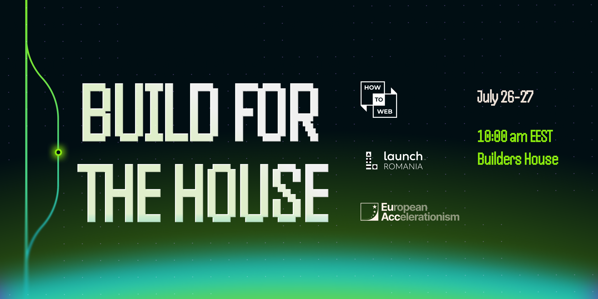
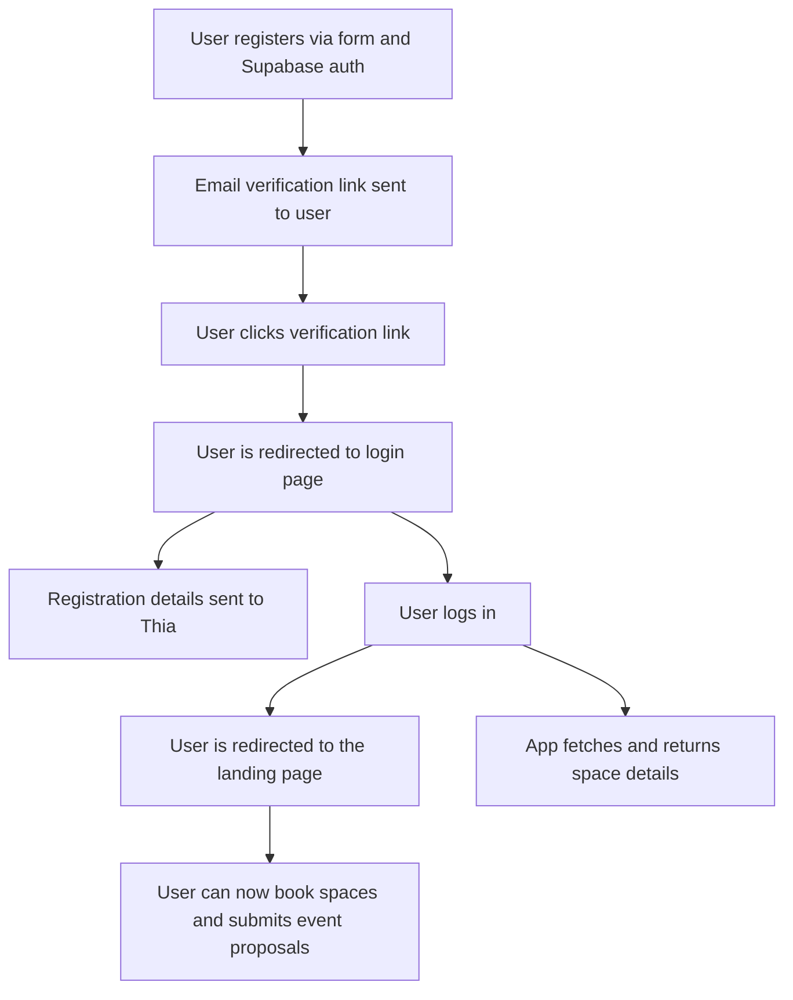
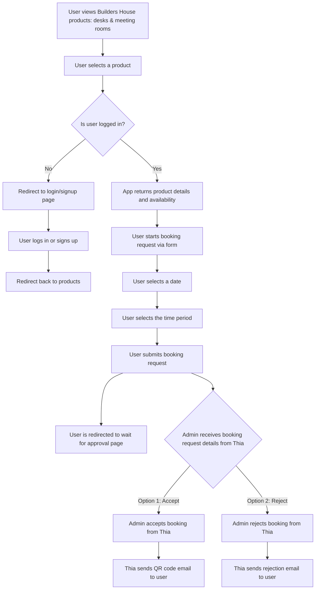
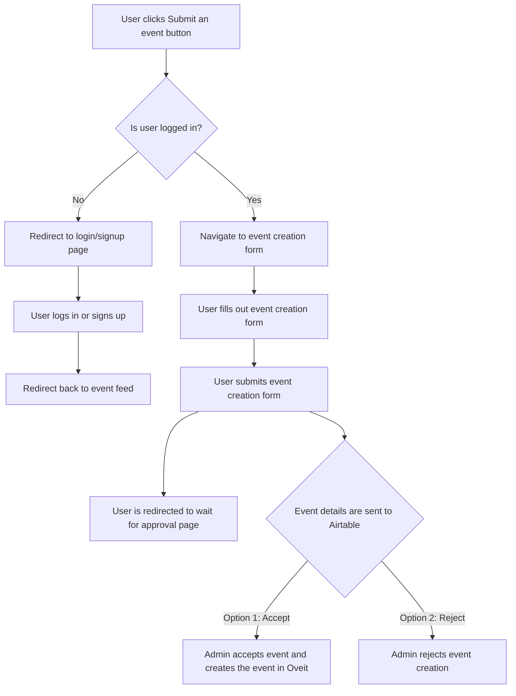

# Builders House Hackathon

## Goal

Create the digital identity for **Builders House** by *[How to Web](https://howtoweb.co/)* to showcase its story, enable event discovery, and streamline bookings, fostering a vibrant community of builders and startups.

## Features
- User account creation via Supabase auth (check [user account creation flow](#user-account-creation-flow))
  - Required fields: first_name, last_name, email, password, linkedin_profile_url
  - Optional fields: company_name, company_website_url, company_role, company_description

- Event feed (check [Oveit API docs](./oveit-api-docs.md))

- Event registration flow: user clicks on an event and is redirected to the following URL: `https://oveit.com/hub/org/jnR9vo3A`

- ***User-only*** access for space booking requests (check [booking flow](#user-booking-flow)) 

- ***User-only*** access event proposal requests ([event proposal flow](#user-event-proposal-flow)) 

- Event proposal requests form (all fields are required):
  - event_name
  - event_description
  - event_date
  - event_time
  - event_banner (1200x600 pixels)
  - organizer_name
  - organizer_email
  - organizer_phone
  - organizer_website_url
  - organizer_linkedin_profile_url

- (optional) Use Supabase email templates + SendGrid for custom marketing emails

- (optional) Use Airtable for event proposal requests

## Tech Stack Requirements
- Use the following [template](https://vercel.com/templates/authentication/supabase) to kickstart the project

- Make sure the have an account on Vercel and Supabase. Then you can Deploy the project on Vercel and connect it to your Supabase project.

### Frontend
- [Next.js](https://nextjs.org/docs) for landing page.

- UI has to be [shadcn/ui](https://ui.shadcn.com) and [Tailwind CSS](https://tailwindcss.com/) compatible.
- Why Tailwind? Because we are going to plugin in our own branding colors made with [tweakcn](https://tweakcn.com/)

- You can use any of the following UI kits for your project:
  - [21.dev](https://21st.dev) - A collection of community-driven UI components, where you can get inspired, and also share your creations.
  - [Origin UI](https://originui.com) - A collection of components, layouts and easing classes
  - [Aceternity UI](https://ui.aceternity.com) - Copy-paste components and templates used by Cursor, Cluely and Better-auth
  - [MVP Blocks](https://blocks.mvp-subha.me) - Prebuilt and animated components to ship your MVP fast
  - [Kibo UI](https://www.kibo-ui.com) - A registry of composable and accessible components
  - [Skiper UI](https://skiper-ui.com) - Beautiful components animated with @mattgperry's motion library

### Backend
- Next.js API route handlers ([docs](https://nextjs.org/docs/app/getting-started/route-handlers-and-middleware))

- Supabase for auth ([docs](https://supabase.com/docs/guides/auth/quickstarts/nextjs))

- Supabase for database ([docs](https://supabase.com/docs/guides/database/overview))

- (optional) SendGrid for marketing emails ([docs](https://www.twilio.com/docs/sendgrid/for-developers/sending-email/quickstart-nodejs))

- (optional) Supabase or S3 for asset storage

### Integrations
- Pull events from Oveit API ([docs](https://l.oveit.com/api-documentation/events/))

- Submit booking requests for desks and offices via [Thia.work](https://thia.work) booking API (URL/endpoints provided at the hackathon)

- (optional) Submit event proposals via Airtable form

## User flows

### User account creation flow

### User booking flow

### User event proposal flow

## Deliverables
- Functional prototype (deployed via Vercel/Netlify)

- GitHub repo with code

- 5-min demo video

## Rules
### Show respect, no harassment

