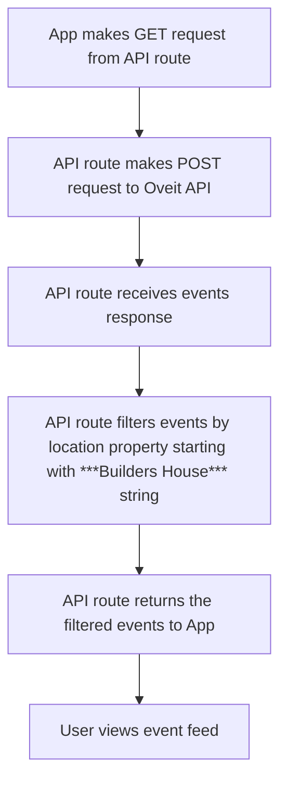

# Oveit API Documentation

## Overview

The Oveit API allows to access and manage events programmatically.

- [Get Event Details](#get-event-details)
- [Event data types](#event-data-types)
- [Event feed flow](#event-feed-flow)

## Endpoint
```
https://l.oveit.com/api/seller/events
```

### Get Event Details

Retrieve the list of events.

**Headers:**
```
Content-Type: application/json
```

**Body:**
```json
{
  token: "oveit_api_token"
}
```

### **Response:** `200 OK`

```json
{
    "events": [
        {
            "id": 100,
            "name": "Build for the House",
            "starts_at": "2025-07-26T10:00:00+03:00",
            "location": "Builders House, Bulevardul Doina Cornea, Bucure\u0219ti, Romania",
            "tickets": 50,
            "tickets_checked_in": 30,
            "tickets_sold": 50,
            "ticket_types": [
                {
                    "id": 234, 
                    "name": "Entry ticket", 
                    "price": "0.00 RON"
                },
                {
                    "id": 235, 
                    "name": "VIP entry", 
                    "price": "200 EUR",
                    "addons": [
                        {
                            "id": 8,
                            "name": "Free beers",
                            "is_bundled": true,
                            "uses": 4,
                            "enabled": true
                        },
                        {
                            "id": 9,
                            "name": "Free T-shirt",
                            "is_bundled": true,
                            "uses": 1,
                            "enabled": false
                        }
                    ]
                }
            ]
        }
    ]
}
```

### **Event data types:**

```typescript
interface Event {
    id: number; // Unique event identifier
    name: string; // Event name
    starts_at: string; // Start time (ISO 8601)
    location: string; // Event location
    tickets: number; // Total tickets available
    tickets_checked_in: number; // Number of tickets checked in
    tickets_sold: number; // Number of tickets sold
    ticket_types: TicketType[]; // Array of ticket types
}

interface TicketType {
    id: number; // Unique ticket type identifier
    name: string; // Ticket type name
    price: string; // Ticket price (e.g., "100 USD")
    addons?: Addon[]; // Optional array of addons
}

interface Addon {
    id: number; // Unique addon identifier
    name: string; // Addon name
    is_bundled: boolean; // Whether the addon is bundled
    uses: number; // Number of uses
    enabled: boolean; // Whether the addon is enabled
}
```

### Event feed flow

